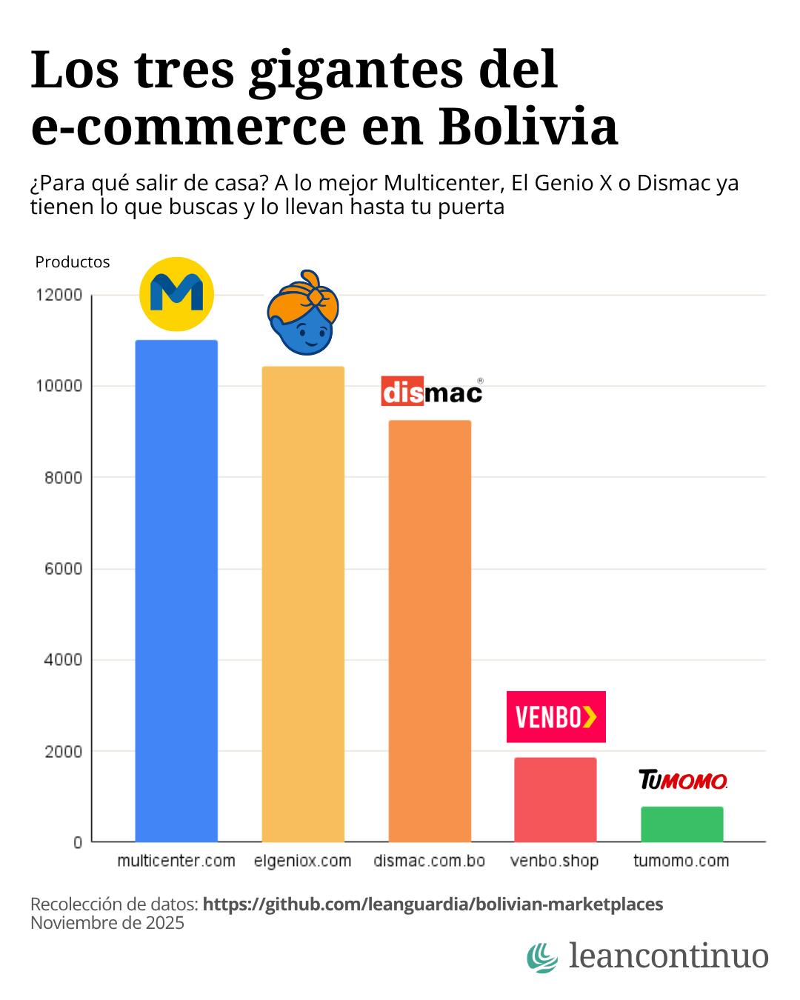

# Bolivian Marketplace Data

A collection of web scrapers for major e-commerce marketplaces in Bolivia, providing product catalog counts.




## 📊 About

This project tracks and analyzes product catalogs across Bolivia's main online marketplaces. The chart below shows the number of products available on each platform:

```
┌─────────────────────────────────────────────────────────────────────┐
│                    Bolivian Marketplace Products                    │
│                        (November 12, 2025)                          │
├─────────────────────────────────────────────────────────────────────┤
│ multicenter.com     ████████████████████████████████████  10,999    │
│ elgeniox.com        ███████████████████████████████████   10,426    │
│ dismac.com.bo       ██████████████████████████████████     9,264    │
│ venbo.shop          ██████                                 1,857    │
│ tumomo.com          ███                                      784    │
│ boliviamart.com     █                                        138    │
│ Eyava               ?                                          ?    │
│ Camsa               ?                                          ?    │
│ Tibo                ?                                          ?    │
│ Tienda Amiga        ?                                          ?    │
└─────────────────────────────────────────────────────────────────────┘
```

## 📈 Data Summary

| Marketplace         | Products | Status    |
|---------------------|----------|-----------|
| multicenter.com     | 10,999   | ✅ Scraped |
| elgeniox.com        | 10,426   | ✅ Direct  |
| dismac.com.bo       | 9,264    | ✅ Scraped |
| venbo.shop          | 1,857    | ✅ Scraped |
| tumomo.com          | 784      | ✅ Scraped |
| boliviamart.com     | 138      | ✅ Scraped |
| Eyava               | ?        | ⏳ Pending |
| Camsa               | ?        | ⏳ Pending |
| Tibo                | ?        | ⏳ Pending |
| Tienda Amiga        | ?        | ⏳ Pending |

**Data collected:** November 12, 2025

### Notes

- **Only products, no variants** — Each count represents unique products, not product variations (size, color, etc.)
- **Categorized products only** — Includes only products properly assigned to categories
- **Santa Cruz sample** — For stores with multiple city locations, Santa Cruz was used as the sample
- **elGenioX data** — Data obtained directly from the company through prior work relationship

## 🗂️ Data Collection

Each folder contains its own scraper implementation or evidence of the reported results:

- **`boliviamart/`** — Scraper for boliviamart.com
- **`dismac/`** — Scraper for dismac.com.bo
- **`multicenter/`** — Scraper for multicenter.com
- **`tumomo/`** — Scraper for tumomo.com
- **`venbo/`** — Scraper for venbo.shop

## 🛠️ Technology Stack

- **Development:** Python 3.13
- **AI Assistant:** Claude (Anthropic)
- **Libraries:** BeautifulSoup4, Requests, Selenium (where needed)

## 🚀 Getting Started

Navigate to any scraper folder and follow its specific README for setup and usage instructions.

```bash
cd <marketplace-folder>
pip install -r requirements.txt
python scraper_<marketplace>.py
```

## 🤝 Collaboration

Contributions, suggestions, and feedback are welcome!

- **Issues:** Please open an issue on this repo
- **Direct contact:** Feel free to reach out directly for collaboration

## 📝 License

This project is licensed under the MIT License - see the [LICENSE](LICENSE) file for details.

**Note:** This project is for research and educational purposes. Please respect the terms of service of each marketplace when using these scrapers.
